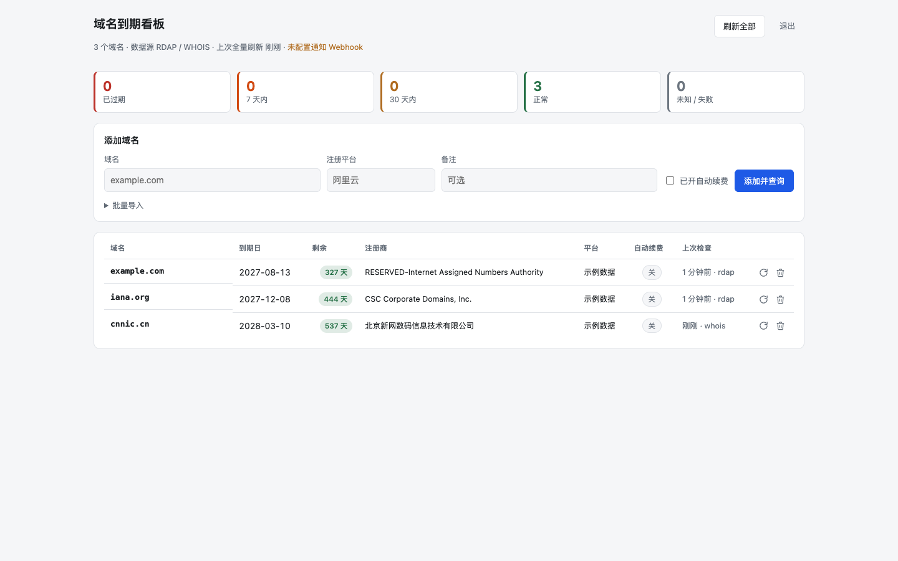

# domain-manager

> Cross-registrar domain expiration dashboard on Cloudflare Workers.
> One page for every domain you own, no matter which registrar sold it to you.

跨注册商的域名到期监控看板，跑在 Cloudflare Workers 上。

你在阿里云买了 `.cn`、在 Namecheap 买了 `.com`、在别处买了 `.dev` —— 每个平台的续费提醒
都只发到自己站内信里。这个项目把它们汇总到一个页面：按剩余天数排序、到期前自动提醒。

**不需要任何注册商的 API 密钥。** 域名到期时间由注册局（registry）持有，与你在哪家注册商
购买无关，因此一套 RDAP + WHOIS 查询就能覆盖所有平台。



## 功能

- 统一看板：剩余天数排序，已过期 / 7 天内 / 30 天内分色，暗色模式自适应
- 数据来源：RDAP 优先（结构化、无需认证），无 RDAP 的 TLD（如 `.cn`）自动回退 WHOIS（TCP 43）
- 网页上增删域名，支持批量导入（每行一个，可附平台标注与年成本）
- 注册日列：注册局记录的首次注册日期（即购买/创建时间），RDAP 事件与 WHOIS 创建字段并行解析
- 日期筛选：按到期日或注册日的起止区间过滤看板
- 年成本手填：表格里直接改，看板给出合计，到期提醒里带上续费金额
- 设置页：密码、Webhook、提醒天数、币种都在页面上改，保存即生效，不用重新部署
- 子域名自动归约：填 `blog.example.com` 会查询 `example.com`
- 定时刷新：Cron Triggers 每天跑一次，无需自建服务器
- 到期提醒：30 / 7 / 1 / 0 天四档，合并成一条消息投递到 Webhook
  （钉钉 / 企业微信 / 飞书 / Slack / 通用 JSON）
- 密码登录 + 签名 Cookie，登录失败限速；未设置密码时看板拒绝所有访问
- 监控自检：某域名连续 3 次查询失败会随提醒一起上报，避免静默失效

## 为什么不用注册商 API

| 方案 | 问题 |
| --- | --- |
| 阿里云 / Namecheap API | 每个平台一套 SDK、一对密钥、一种限流策略；换平台就要改代码 |
| WHOIS 网页爬虫 | 页面改版即失效 |
| **RDAP + WHOIS（本项目）** | IANA 维护的注册局标准接口，`.com`/`.org`/`.dev` 等直接走 RDAP；`.cn` 等 ccTLD 走 WHOIS 兜底 |

到期时间存在注册局，所以无论域名在哪家注册商，查到的都是同一份权威数据。

## 部署

前置：一个 Cloudflare 账号，本地装好 Node.js（wrangler 通过 npx 调用，无需全局安装）。
Workers 与 D1 的免费额度对个人用量足够。

```bash
npm install

# 1. 创建 D1 数据库，并把返回的 database_id 填进 wrangler.jsonc
npx wrangler d1 create domain-manager

# 2. 建表
npm run db:init:remote

# 3. 设置登录密码（必填，不设则看板拒绝所有访问）
npx wrangler secret put ADMIN_PASSWORD

# 4. 可选：到期通知（也可以部署后在设置页填）
npx wrangler secret put WEBHOOK_URL
npx wrangler secret put WEBHOOK_TYPE    # generic | dingtalk | wecom | feishu | slack

# 5. 部署
npm run deploy
```

打开 `https://<你的 worker>.workers.dev`，用设置的密码登录，添加域名即可。
第 3、4 步的 Secret 只是**首次部署的引导值**：登录后在「设置」页保存一次，配置就迁到
D1，之后以页面上的值为准（密码只存 PBKDF2 哈希）。

定时任务默认每天 UTC 03:17（北京 11:17）执行，在 `wrangler.jsonc` 的 `triggers.crons` 修改。

> **克隆者注意**：仓库里 `wrangler.jsonc` 的 `database_id` 是作者自己的 D1 数据库。
> 部署前必须先执行第 1 步并替换成你自己的 ID，否则你的 Worker 会读写作者的数据库。

> **从旧版本升级**：不需要手动迁移。新版会在首个请求里自动给 `domains` 补 `cost` 列、
> 建 `settings` 表；已有的域名与查询历史不受影响。

## 配置

Secret（`wrangler secret put <NAME>`）只是引导值，页面上保存过就以 D1 为准：

| 名称 | 必填 | 说明 |
| --- | --- | --- |
| `ADMIN_PASSWORD` | 是 | 看板登录密码；在设置页改密码后此 Secret 不再参与校验 |
| `WEBHOOK_URL` | 否 | 到期通知接收地址 |
| `WEBHOOK_TYPE` | 否 | `generic`（默认）/ `dingtalk` / `wecom` / `feishu` / `slack` |
| `NOTIFY_DAYS` | 否 | 提醒阈值，逗号分隔，默认 `30,7,1,0` |
| `DISABLE_AUTH` | 否 | 设为 `1` 关闭鉴权，仅本地调试用，**不在设置页暴露** |

`wrangler.jsonc`：

- `d1_databases[0].database_id`：换成你自己创建的 D1 数据库 ID
- `triggers.crons`：刷新周期

设置页（登录后右上角「设置」）可改：Webhook 地址与消息格式、提醒天数、币种、登录密码。
保存立即生效，无需重新部署。改密码需要再输一次当前密码，且会让所有已登录会话失效；
`WEBHOOK_TYPE` 也接受 `wechat` / `lark` 作为 `wecom` / `feishu` 的别名。

## HTTP API

看板页面是服务端渲染的；以下 JSON 接口可供脚本或其他系统集成。
除 `/healthz` 外都需要登录 Cookie；变更类接口（POST / PATCH）还要求请求头
`x-requested-with: domain-manager`，表单删除接口则改用隐藏字段 `csrf`。

| 方法 | 路径 | 说明 |
| --- | --- | --- |
| GET | `/healthz` | 存活与建表状态，无需登录 |
| GET | `/api/domains` | 全部域名，含剩余天数、告警级别与年成本 |
| POST | `/api/domains` | 添加单个域名并立即查询，body 可带 `cost` |
| POST | `/api/domains/bulk` | 批量添加，body：`{items:[{domain, platform, cost}]}` |
| PATCH | `/api/domains/:id` | 修改 `platform` / `note` / `autoRenew` / `notify` / `cost` |
| POST | `/api/domains/:id/refresh` | 立即重新查询单个域名 |
| POST | `/api/domains/:id/delete` | 表单删除 |
| POST | `/api/refresh` | 全量刷新并触发提醒判定 |
| POST | `/api/settings` | 表单保存设置（密码 / Webhook / 提醒天数 / 币种） |
| GET | `/api/checks/:domain` | 单个域名最近 30 次查询历史（来源、到期日、错误） |

## 安全与隐私

- 只查询注册局的公开数据（RDAP / WHOIS），**不存储任何注册商账号或 API 密钥**
- 域名清单、查询历史与设置都存在你自己 Cloudflare 账号的 D1 里，不经过第三方
- 密码在 D1 里只存 PBKDF2-SHA256 哈希（随机盐、10 万迭代），不存明文；
  会话签名与 CSRF token 由该哈希派生，改密码即让所有会话失效
- Webhook 地址（含平台 token）在 D1 中是明文，界面上打码显示——这是「页面上可改」的代价
- 会话用 HMAC 签名 Cookie 维持；密码与 CSRF 比较均为常量时间
- 登录失败按 IP 限速：15 分钟内 10 次后暂时锁定
- 变更接口要求自定义请求头，配合 `SameSite=Lax` Cookie 抵御 CSRF

## 已知限制

- 部分注册局不公开到期时间（`.de`、`.nl` 等）。这类域名能查到注册商但到期日显示「未知」，
  需要自行到注册商控制台确认。注册日同理：注册局不公开首次注册日期时该列显示「—」。
- WHOIS 服务器有速率限制。域名数量在几百以内没有问题；批量导入后首次全量查询会按
  并发 3、间隔 250ms 限速执行。
- 自动续费状态无法从注册局获知，看板上的「自动续费」是手动标记，仅用于提醒时参考。

## 本地开发

```bash
npm run db:init:local   # 本地 D1 建表
echo 'DISABLE_AUTH=1' > .dev.vars
npm run dev             # http://localhost:8787
```

本地 `wrangler dev` 默认使用本地 D1；要连线上 D1 加 `--remote`。

## 架构

```
src/
├── index.ts            Hono 路由、鉴权中间件、Cron 入口
├── db.ts               D1 读写、看板视图模型（剩余天数 / 告警级别）、旧库自动补列
├── auth.ts             HMAC 签名 Cookie、PBKDF2 密码哈希、登录限速
├── settings.ts         设置读取层：D1 优先、env Secret 兜底
├── cost.ts             年成本输入校验与合计
├── scheduler.ts        全量刷新、提醒阈值判定与去重
├── notify.ts           Webhook 适配器
├── ui.ts               服务端渲染的看板 HTML/CSS/JS（无前端构建步骤）
└── lookup/
    ├── index.ts        RDAP → WHOIS 的查询编排与可注册域归约
    ├── rdap.ts         IANA RDAP bootstrap + 解析
    ├── whois.ts        TCP 43 WHOIS 客户端、IANA 服务器发现
    ├── whois-lookup.ts 常见 ccTLD 服务器表 + WHOIS 解析
    ├── tld.ts          二级公共后缀表（.co.uk 等）
    ├── parse.ts        各注册局日期/注册商字段解析
    └── domain.ts       域名归一化与后缀候选
```

两个实现细节值得留意：

- **WHOIS 的 TCP 连接写完查询后必须 `releaseLock()` 而不是 `close()`。**
  `close()` 会连带关闭读方向，服务端响应还没到就被丢弃，读回 0 字节。
- **IANA RDAP bootstrap 不是公共后缀表。** `.uk` 在表里登记为 `uk` 而非 `co.uk`，
  若直接按命中标签数推断可注册域，`bbc.co.uk` 会被归约成 `co.uk` —— 而 `co.uk`
  本身是 Nominet 持有的真实域名，查询会“成功”并返回完全无关的数据。
  因此 `lookup/tld.ts` 维护了一份二级公共后缀清单优先匹配。
- **Workers 的 Secret 运行时只读**，代码无法把页面上填的密码写回 `env.ADMIN_PASSWORD`。
  所以设置页的数据落在 D1 的 `settings` 表，env Secret 只作首次部署的引导值；
  密码存 PBKDF2 哈希，会话签名密钥由该哈希派生，从而保留「改密码即踢掉所有会话」。

## Contributing

欢迎 issue 和 PR。改动查询逻辑时请附上真实域名的验证结果
（`GET /api/checks/:domain` 能看到每次查询的来源与原始错误）——
各注册局的字段格式差异很大，没有实测很难判断解析是否正确。

`npm run check` 跑 TypeScript 类型检查，提交前请确保通过。

## License

MIT
